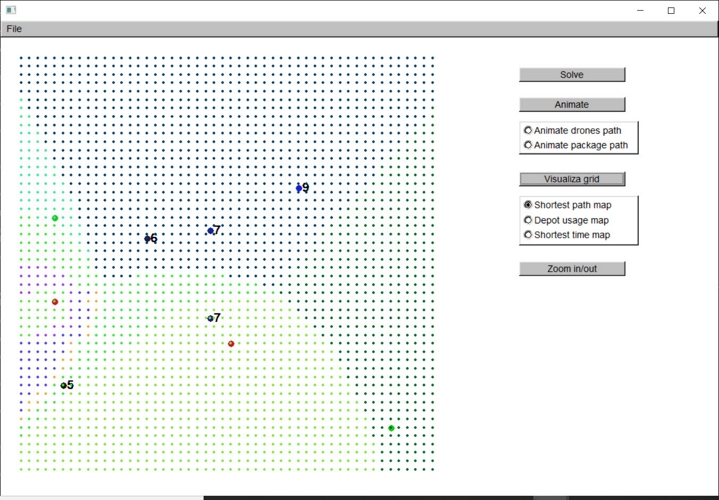

# Package delivery with a group of agents

This is the repository for the following problem:

Given n agents of different speeds, a package(s) from a source(s) and a destination(s), find a way for the agents to deliver the package to the destination as fast as possible.

Two agents can exchange a package. Agents can have different speeds. Each agent can carry at most one package and they have unlimited battery/fuel in the delivery.

### ===========HOW TO COMPILE AND RUN===========

Requirement: C++ 11

Main source directory: ndrones/ndrones/

Dependencies:

* FLTK 1.3.5 (If you want to use main_gui.cpp, if you use main_no_gui.cpp these won't be needed)
  * All include files are in ndrones/includes/
  * All necessary lib files for linking are in ndrones/lib/
  * Dependencies needed to compile:
    * fltkd.lib
    * fltkformsd.lib
    * fltkgld.lib
    * fltkimagesd.lib
    * fltkjpegd.lib
    * fltkpngd.lib
  * NOTE: these files were compiled in for Windows using Visual Studio 15 (2017). If you cannot compile with these, then you will need to download the source FLTK here https://www.fltk.org/software.php (1.3.5), unpack them and recompile these.
* cxxopts
  * All include files are in ndrones/includes
  * No linking needed

Compiling:

The process to compile the no-gui file is pretty straightforward (only cxxopts is needed). To compile with GUI on:

* On Windows (recommend using Visual Studio):
  * Add the ndrones/includes/ directory to your include option
  * Add the ndrones/lib/\*.lib files mentioned above when you compile

* On Linux:
  * Install FLTK 1.3.5 https://www.fltk.org/software.php , along with their helper tools fltk-config (included in the default setup)
  * Use g++ to compile:
    * Add an include directory option (-I) to 'ndrones/include/' (Don't use the FLTK include directory as there are some small compiler errors)
    * Add the ndrones/lib/ directory to your lib directory option (-L)
  * The final build command would look like something as follow:
  
```
g++ `fltk-config --cxxflags` main_gui.cpp gui.cpp scenario.cpp scenarioIO.cpp base.cpp util.cpp -I'../include/' -L'../lib/' `fltk-config --ldflags` -fpermissive -o ndrones
```

To run the program in the command line:
```
ndrones.exe -g [0|1] -i [input_path] -o [output_path]

# -g: turning on GUI (1), or off (0). Only needed when building from main_gui.cpp
# input_path: full or relative path to input file
# output_path: full or relative path to output file you want to write
```
To test if the program is running correctly, run it with the ndrones/ndrones/testcase/input0.txt

Input file: the format of an input file is described in ndrones/ndrones/inputDescription.txt

Output file: ndrones/ndrones/outputDescription.txt

### ===========PROBLEM DETAILS===========
**There are two main problems:**

1 There are multiple agents, but there is only 1 destination to consider. These problems are depicted as 
```
TWODIM EUCLID DISCRETE SINGLE_ID
```
on the top of each input file.

  1.1 It is possible to have more than one sources here, each serves the same purpose, i.e. the agents can pick up the package from any of those sources.

2 There are more than one destination to consider. This will then be on top of the input file:
```
TWODIM EUCLID DISCRETE
```

**In each of these above problem types, we can specify two types of source/destination geometry.**

They can be points:
```
SINGLE_POINT
```
or polygons (regional):
```
POLY
```

**Sampling method:**
The algorithm work on a discrete set of points. All of the handoffs occur on these points. The recommended sampling method is
```
APGRID
x1 y1 sx
x2 y2 sy
```
Which create a grid from (x1, y1) to (x2, y2) in which any two adjacent points are spaced by sx/sy along the x/y direction.

### ===========VISUALIZATION (GUI MODE)===========


The main GUI:


* Sources are drawn in red. Destinations are drawn in green.
* All agents are drawn in either black or blue. The bluer some agents are, the faster they are in term of speed. The number next to each of them is their speed (units/second).

* To solve the problem with loaded input. Hit "Solve.
* To animate the delivery, check "Animate drones path" and hit Animate.
* To animate the path of the package, check "Animate package path".



The grid points that was sampled can be visualized with "Visualize grid" button. This does not work with multiple targets of different IDs.
* Shortest path map: points will be colored into different regions. Each region of the same color has the same agents solution.
* Depot usage map: each region of the same color uses the same depot in the optimal solution.
* Shortest time map: depicts the heat map of delivery time from some depots to each point.
